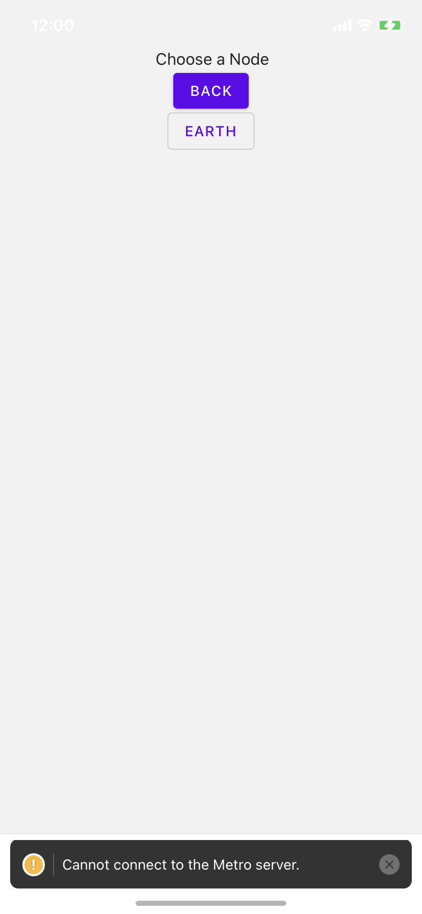
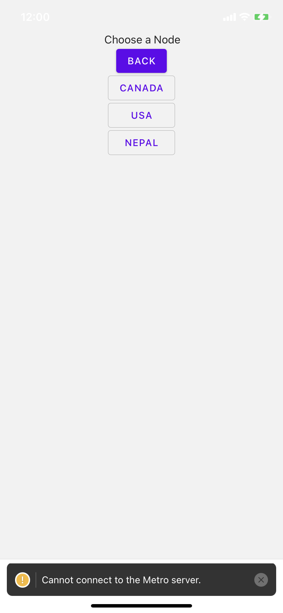
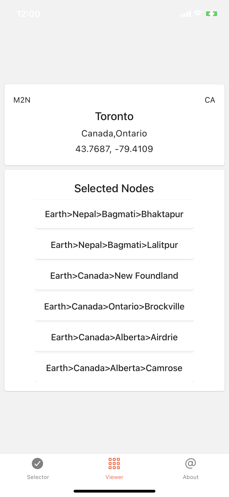
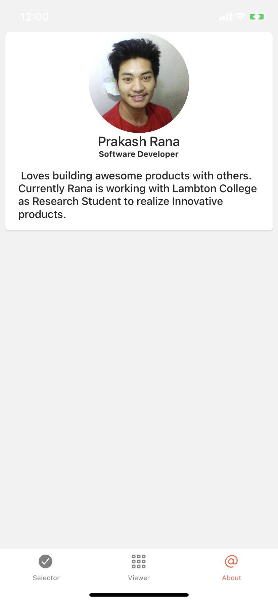

# React-native-project-app
Simple React Native App for demonstration

## Installation Guide For IOS App in Mac
1. brew install node
2. brew install watchman
3. Create a simulator in Xcode 
4. You will also need to install the Xcode Command Line Tools
5. sudo gem install cocoapods

6. Install Pods 
    from root project directory move to ios directoty and install pods 
    * cd ios
    * pod install
7. Start metro from root directory:  npx react-native start
8. Start ios app from root directory: npx react-native run-ios

## Project Description
 
 App has three screens:
 1. Selector: 
        Here you will be presented with tree data with one level at a time. Each selection will take you further down the tree.
        Once you reach the leaf node you can mark or unmark the leaf node.

        The code will work for any tree structure with any level of depth. Tree can be unbalanced with one branch ending at n while any other branch ending at k : k > n or k< n

 
 
 

 2. Viewer:
        Here you will be presented with two main sections:
        1. The Geo data of your current location fetched from an public api
        2. All the nodes that you selected in screen 1

 

 
 3. About:
        Here you will be presented with simple about me page.
 

Navigation in the app happens through tab navigation